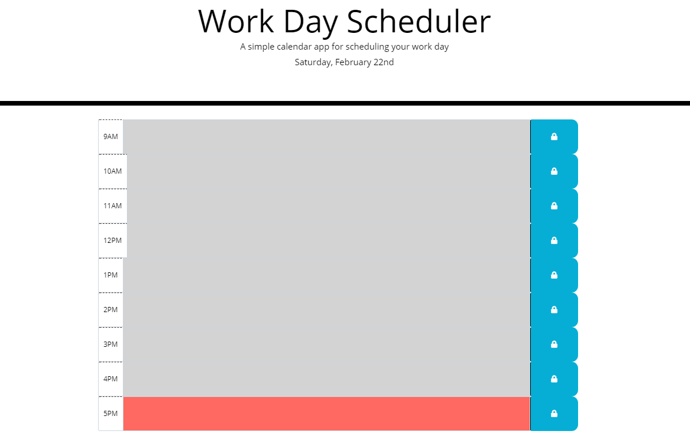

# Work Day Scheduler
In this homework assignment we were asked to create a simple calendar application that allows the user to save events for each hour of the day. The current date should be displayed at the top and the text boxes should be properly color coded to show if the hour of the box is before, the same, or past the current hour. When the save button is clicked, the contents of the text box should be saved into local storage, and when the page is refreshed, should remain in the boxes. The thing I found most challenging with this project, was how to assign each box it's own key for local storage so that they do not get all chaoticly put in the same object, and how to pull them from local storage into their appropriate boxes. In the end I utilized an object array that I assigned globally to call on the correct key from local storage. Again I forgot to commit constantly, I will need to make sure to add that to my psuedocoding. 

## Deployed Project

[Work Day Scheduler](https://tristinbarnett.github.io/workdayscheduler/)

